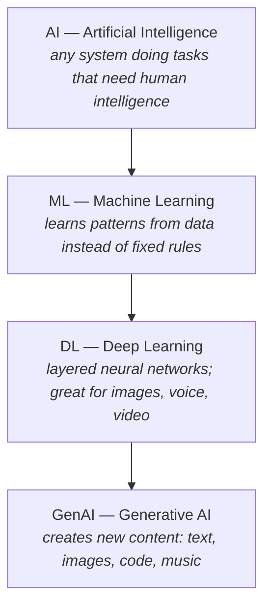

# AI & ML Basics

## What Is AI?

- AI (Artificial Intelligence) is the ability of machines/computers to do tasks that
  normally require human intelligence — like understanding language, recognizing
  images, making decisions, and learning from experience.
- Examples: recognizing images, understanding speech, creating content, learning from data.

!!! tip "Think of it as"
    Teaching computers to "think" and solve problems the way humans do — but faster
    and at scale.

## How Does AI Work?

- A data scientist collects a **training dataset** (e.g. pictures of fruits).
- They use a **classification algorithm** to train a model.
    - Classification = teaching the model to sort things into categories,
      like "Apple" vs "Orange".
- The trained AI model can then take new input (e.g. a photo) and predict what it is
  (e.g. "Apple").

## Common AI Use Cases

- Speech recognition & generation
- Medical diagnosis
- Fraud detection
- Self-driving cars
- Code suggestions for developers
- Translating languages
- Automating business processes
- Intelligent Document Processing (uses Computer Vision + NLP)

## AI Nesting (Important Concept)

AI contains Machine Learning, which contains Deep Learning, which contains Generative
AI — each one is a subset of the one before it:

In set notation: **AI ⊃ ML ⊃ DL ⊃ GenAI**.

### The layers, explained

- **AI (Artificial Intelligence)** — the broadest umbrella; any system that can do
  tasks that normally need human intelligence.
    - Example: a chatbot answering questions, a system detecting spam emails.
- **Machine Learning (ML)** — a subset of AI. Instead of writing exact rules, you feed
  data and it learns patterns on its own.
    - Example: show 10,000 emails labeled "spam"/"not spam" → it classifies new emails
      by itself.
    - Key idea: it improves with more data.
- **Deep Learning (DL)** — a subset of ML that uses layers (like steps) to understand
  data, from simple to complex.
    - Example: recognizing a cat in a photo — Layer 1 detects edges and lines, Layer 2
      combines edges into shapes (ears, eyes), Layer 3 puts shapes together and says
      "That's a cat!"
    - Each layer builds on the previous one, going deeper — that's why it's called
      Deep Learning.
    - Needs a lot of data and computing power; great for hard stuff like images, voice,
      and video. You don't tell it what to look for — it figures it out on its own.
- **Generative AI (GenAI)** — a subset of DL. Doesn't just analyze or classify — it
  **creates** new content (text, images, code, music, video).
    - Example: ChatGPT writing text, DALL·E creating images from descriptions.
    - Key idea: it produces something new rather than just making predictions.

!!! tip "Think of it as"
    Deep Learning is a funnel: raw data goes in, and through many layers, a smart answer
    comes out.

### Key differences between ML, DL, and GenAI

| | What it does |
|---|---|
| **ML** | Predict / classify using learned patterns in data |
| **DL** | Same kinds of tasks as ML, but on harder, high-dimensional problems (images, audio, video) using deep neural networks |
| **GenAI** | Uses DL techniques specifically to **create** new content (text, images, code, music) rather than only classifying/predicting |

- GenAI is built on top of DL, which is built on top of ML — so GenAI inherits all
  their abilities **plus** adds the power to create.
- What makes GenAI special is the creation part; the others are built to analyse,
  not create.

!!! info
    DL isn't limited to classification — generative DL models (GANs, diffusion,
    transformers) **are** what power GenAI. The framing above is a simplification for
    learning.

### A simple way to remember

| Term | One-liner |
|---|---|
| **AI** | "machines acting smart" |
| **ML** | "machines learning from data" |
| **DL** | "machines learning using brain-like networks" |
| **GenAI** | "machines that analyse, predict, **and** create new content" |

## Types of Machine Learning

There are three main flavours of ML, separated by where the "correct answers" come from
during training: a human, nobody, or the data itself.

### Supervised Learning

In **supervised learning**, the training data comes with labels — the correct answers a
human (or an existing system) has attached. You show the model 10,000 emails each tagged
"spam" or "not spam", and it learns the mapping from input to known output. Once trained,
it predicts the label for new, unseen emails.

It is used for two kinds of task: **classification** (predict a category — "spam" vs
"not spam") and **regression** (predict a number — tomorrow's temperature). The labels
act like a teacher's answer key: every example carries its correct answer, so the model
can check itself and improve.

### Unsupervised Learning

In **unsupervised learning**, the data has no labels — only the raw inputs. There is no
"right answer" to predict. Instead the model finds structure on its own: grouping
similar items together (**clustering**) or simplifying complex data while keeping what
matters (**dimensionality reduction**). For example, grouping customers by shopping
behaviour without anyone telling it which group is which, or what to call them — like
sorting a pile of photos into groups that "look alike" with no categories given upfront.

### Self-Supervised Learning

The third flavour sits between the two — and it is the one that powers large language
models.

In **self-supervised learning**, nobody hand-labels the data, but the data still
provides its own correct answers. You take raw text, hide part of it, and ask the model
to predict the missing part. The "label" is simply the piece that was hidden — it was
there all along.

- Take the sentence "The cat sat on the **mat**."
- Hide the last word: "The cat sat on the ___."
- The model predicts the missing word, then compares against the real one (`mat`) and
  corrects itself. Repeat across billions of sentences.

No human labelled anything, yet every example has a right answer baked in. That is why
it is called *self*-supervised: the supervision comes from the data itself, not from a
person.

| | Supervised | Unsupervised | Self-Supervised |
|---|---|---|---|
| **Labels?** | Human-made | None | Made automatically from the data |
| **Has a "right answer"?** | Yes | No | Yes (the hidden part) |
| **Typical use** | Classify / predict | Find structure | Pre-train LLMs on raw text |

!!! tip "Think of it as"
    Making your own flashcards by covering a word in a sentence you already have. The
    sentence is both the question *and* the answer key — you don't need a teacher to
    write the cards for you.

!!! note "Why this matters for GenAI"
    Generative models train on HUGE amounts of data — labelling it all by hand is
    impossible. So GenAI relies on **self-supervised** training over unstructured data
    (raw text, raw images): the model learns the distribution of the data itself by
    repeatedly predicting hidden parts of it. This is exactly how an LLM learns language
    before you ever send it a prompt.
