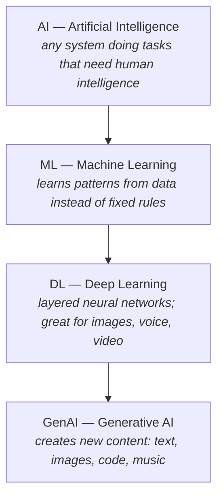

# Topic 1: AI & ML Basics

## What Is AI?

- AI (Artificial Intelligence) is the ability of machines/computers to do tasks that
  normally require human intelligence — like understanding language, recognizing
  images, making decisions, and learning from experience.
- Examples: recognizing images, understanding speech, creating content, learning from data.

!!! tip "Think of it as"
    Teaching computers to "think" and solve problems the way humans do — but faster
    and at scale.

## How Does AI Work?

- A data scientist collects a **training dataset** (e.g. pictures of fruits).
- They use a **classification algorithm** to train a model.
    - Classification = teaching the model to sort things into categories,
      like "Apple" vs "Orange".
- The trained AI model can then take new input (e.g. a photo) and predict what it is
  (e.g. "Apple").

## Common AI Use Cases

- Speech recognition & generation
- Medical diagnosis
- Fraud detection
- Self-driving cars
- Code suggestions for developers
- Translating languages
- Automating business processes
- Intelligent Document Processing (uses Computer Vision + NLP)

## AI Nesting (Important Concept)

AI contains Machine Learning, which contains Deep Learning, which contains Generative
AI — each one is a subset of the one before it:

In set notation: **AI ⊃ ML ⊃ DL ⊃ GenAI**.

### The layers, explained

- **AI (Artificial Intelligence)** — the broadest umbrella; any system that can do
  tasks that normally need human intelligence.
    - Example: a chatbot answering questions, a system detecting spam emails.
- **Machine Learning (ML)** — a subset of AI. Instead of writing exact rules, you feed
  data and it learns patterns on its own.
    - Example: show 10,000 emails labeled "spam"/"not spam" → it classifies new emails
      by itself.
    - Key idea: it improves with more data.
- **Deep Learning (DL)** — a subset of ML that uses layers (like steps) to understand
  data, from simple to complex.
    - Example: recognizing a cat in a photo — Layer 1 detects edges and lines, Layer 2
      combines edges into shapes (ears, eyes), Layer 3 puts shapes together and says
      "That's a cat!"
    - Each layer builds on the previous one, going deeper — that's why it's called
      Deep Learning.
    - Needs a lot of data and computing power; great for hard stuff like images, voice,
      and video. You don't tell it what to look for — it figures it out on its own.
- **Generative AI (GenAI)** — a subset of DL. Doesn't just analyze or classify — it
  **creates** new content (text, images, code, music, video).
    - Example: ChatGPT writing text, DALL·E creating images from descriptions.
    - Key idea: it produces something new rather than just making predictions.

!!! tip "Think of it as"
    Deep Learning is a funnel: raw data goes in, and through many layers, a smart answer
    comes out.

### Key differences between ML, DL, and GenAI

| | What it does |
|---|---|
| **ML** | Predict / classify using learned patterns in data |
| **DL** | Same kinds of tasks as ML, but on harder, high-dimensional problems (images, audio, video) using deep neural networks |
| **GenAI** | Uses DL techniques specifically to **create** new content (text, images, code, music) rather than only classifying/predicting |

- GenAI is built on top of DL, which is built on top of ML — so GenAI inherits all
  their abilities **plus** adds the power to create.
- What makes GenAI special is the creation part; the others are built to analyse,
  not create.

!!! info
    DL isn't limited to classification — generative DL models (GANs, diffusion,
    transformers) **are** what power GenAI. The framing above is a simplification for
    learning.

### A simple way to remember

| Term | One-liner |
|---|---|
| **AI** | "machines acting smart" |
| **ML** | "machines learning from data" |
| **DL** | "machines learning using brain-like networks" |
| **GenAI** | "machines that can do it all — analyse, predict, AND create new stuff" |

## Supervised vs Unsupervised Learning

Two main flavours of ML, based on whether your training data has labels.

| | Supervised Learning | Unsupervised Learning |
|---|---|---|
| **Data** | Comes with labels (correct answers) | No labels — only the inputs |
| **What it learns** | A mapping from input → known output | Structure / patterns on its own |
| **Used for** | Classification (predict a category), Regression (predict a number) | Clustering (group similar things), dimensionality reduction |
| **Example** | 10,000 emails tagged "spam"/"not spam" → predicts the tag on new emails | Group customers by shopping behaviour without telling it which group is which |

!!! tip "Think of it as"
    **Supervised** = learning with a teacher who gives you the answer key.
    **Unsupervised** = learning by spotting patterns, no answer key given.

!!! note "Why this matters for GenAI"
    Generative models train on HUGE amounts of data — labelling it all is impossible.
    So GenAI relies on **unsupervised / self-supervised** training over unstructured
    data (raw text, raw images) to learn the distribution of the data itself.

## Discriminative vs Generative Models

Two fundamentally different jobs a model can do.

| | Discriminative Model | Generative Model |
|---|---|---|
| **Learns** | The boundary *between* classes | The *distribution* of each class (what the data itself looks like) |
| **Answers** | "Which class is this?" | "Create a new sample like this" |
| **Flow** | Input → Label | Input (noise or a prompt) → new data sample |
| **Example** | Given a photo, output "cat" or "dog" | Given random noise, output a realistic cat image |

!!! tip "Think of it as"
    **Discriminative** = draws the dividing line between cats and dogs.
    **Generative** = learns what a cat looks like well enough to draw one.

!!! note "Why GenAI models are generative"
    They don't just classify — they produce new text, images, audio, video, code.
    That's why they need to learn the underlying distribution, not just the boundary.
