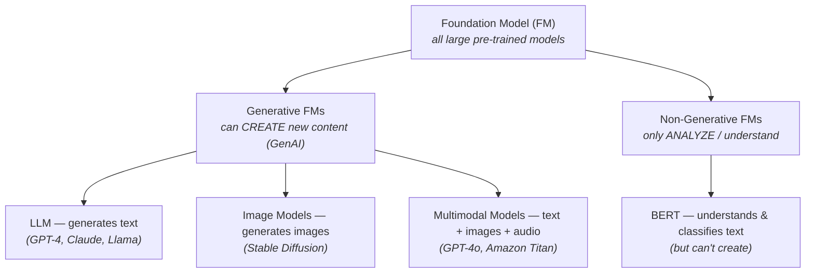
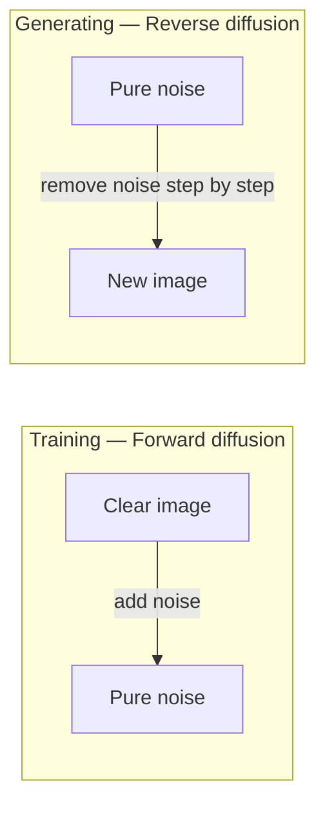

# Foundation Models, LLMs & How They Generate

This topic covers the "what" and the "how":

- **Part A** — the conceptual building blocks: Foundation Models and LLMs.
- **Part B** — the mechanics of how they actually produce output (text & images).

For practical API concerns (tokens, context windows, NLP terms), see
[Tokens & Language](03-tokens-and-language.md). For customizing these models, see
[Customizing Models](04-customizing-models.md).

## Part A — Foundation Models & LLMs (the "what")

### What is Generative AI?

- Generative AI (GenAI) is a subset of Deep Learning.
- Used to generate new data that is similar to the data it was trained on.
- Can generate: text, image, audio, code, video.

!!! note "How GenAI is trained"
    Generative models train on HUGE amounts of data — labelling it all by hand is
    impossible. So GenAI relies on **self-supervised** training over unstructured data
    (raw text, raw images): the model learns the distribution of the data itself by
    repeatedly predicting hidden parts of it (see [self-supervised
    learning](01-basics.md#self-supervised-learning)). This is exactly how an LLM learns
    language before you ever send it a prompt.

    That covers **pre-training** — the first and largest phase. A finished GenAI model is
    not trained by one method alone: it is then refined with **supervised** fine-tuning
    on human-labelled examples (and often a further human-feedback step) to make it
    follow instructions and behave helpfully. So GenAI uses self-supervised *and*
    supervised learning, at different stages — see [Customizing
    Models](04-customizing-models.md).

### Foundation Model (FM)

- A large AI model that is **pre-trained on a massive amount of data** (text, images,
  etc.) so it can perform a broad range of general tasks — text generation,
  summarization, Q&A, image generation, chatbot, and more.
- Trained on a wide variety of input data; may cost **tens of millions of dollars** to
  train.
- Example: GPT-4o is one of the foundation models behind ChatGPT. (ChatGPT has used
  several OpenAI models over time: GPT-3.5, GPT-4, GPT-4o, and newer.)
- Wide selection from companies: OpenAI, Meta, Amazon, Google, Anthropic.

!!! tip "Think of it as"
    A base / starting point that you can then customize for your specific needs.

Licensing varies:

- **Open-source (Apache 2.0):** Google BERT
- **Source-available / free under Meta's own license** (not strictly OSI open-source):
  Meta Llama
- **Commercial license only:** OpenAI (GPT), Anthropic (Claude), etc.

Not all Foundation Models are generative:

- **Non-Generative FM** — only analyzes/understands data (e.g. BERT — classifies,
  extracts info).
- **Generative FM** — analyzes **and** creates new content (e.g. GPT-4, Claude,
  Stable Diffusion).

That split — analyze vs. create — comes from a deeper distinction in what a model is
trained to do.

### Discriminative vs Generative Models

Two fundamentally different jobs a model can do. This is the underlying reason a
foundation model ends up "non-generative" or "generative".

| | Discriminative Model | Generative Model |
|---|---|---|
| **Learns** | The boundary *between* classes | The *distribution* of each class (what the data itself looks like) |
| **Answers** | "Which class is this?" | "Create a new sample like this" |
| **Flow** | Input → Label | Input (noise or a prompt) → new data sample |
| **Example** | Given a photo, output "cat" or "dog" | Given random noise, output a realistic cat image |

!!! tip "Think of it as"
    **Discriminative** = draws the dividing line between cats and dogs.
    **Generative** = learns what a cat looks like well enough to draw one.

#### Examples of discriminative models

A discriminative model always answers "which category?" or "what value?" for an input it
is given — it never creates anything new. These are some of the most common ones, and
you have almost certainly used several today:

- **Spam filter** — email in → "spam" or "not spam".
- **Image classifier** — photo in → "cat", "dog", or "bird".
- **Sentiment analysis** — a review in → "positive" or "negative".
- **Fraud detection** — a card transaction in → "fraud" or "legitimate".
- **Medical imaging** — a scan in → "tumour" or "no tumour".
- **House-price prediction** — size, location, rooms in → a number like \$450,000.

The first five sort the input into a category (**classification**); the last predicts a
number (**regression**). Both are discriminative — neither produces new data, they only
judge the input they are handed.

!!! note "How are discriminative models trained?"
    Usually **supervised** — you need labelled examples ("this photo is a cat") for the
    model to learn where the boundary between classes lies. But labels don't always have
    to be hand-made: **self-supervised** pre-training (labels the data creates for itself)
    is common too. BERT is the classic case — it pre-trains by predicting masked words in
    raw text, then that understanding is fine-tuned for classifying and extracting, not
    generating. What discriminative models don't use is *pure* unsupervised learning: with
    no target answers at all, there is nothing to learn the class boundary from.

!!! note "Why GenAI models are generative"
    They don't just classify — they produce new text, images, audio, video, code.
    That's why they need to learn the underlying distribution, not just the boundary.
    A **Generative FM** is a generative model scaled up to foundation-model size.

### Large Language Models (LLM)

- A type of Foundation Model specifically designed to understand and generate
  human-like text.
- Called "Large" because it has **billions of parameters** and is trained on massive
  text data (books, articles, websites).
- Can perform: translation, summarization, question answering, content creation.
- Notable example: GPT-4 (ChatGPT / OpenAI).

### FM vs GenAI vs LLM — how they relate

- **FM** = the broad category of all large pre-trained models.
- **GenAI** = a capability — FMs that can generate new stuff.
- **LLM** = a specific type of FM focused on text.

!!! tip "Think of it as"
    - **FM** = athletes (all types)
    - **Generative FM** = athletes who can create new plays/moves (creative players)
    - **LLM** = athletes who specialize in cricket (text as the primary data type)

    Modern LLMs increasingly handle images/audio too (**multimodal** — like a cricketer
    who can also bowl and field well). Pure "text-only" LLMs are becoming rarer.

## Part B — How GenAI Generates Output (the "how")

This zooms into the mechanics of **how** models produce output — useful for
understanding temperature, determinism, and why the same prompt can give different
answers.

### How LLMs generate text

- You give the model a prompt (e.g. *"After the rain, the streets were…"*).
- The model generates a list of possible next words with probabilities:
  `"wet" → 40%`, `"flooded" → 25%`, `"slippery" → 15%`, `"empty" → 10%`, …
- An algorithm selects a word from that list based on probability (randomly).
- Then it repeats for the next word, and the next…
- This is **non-deterministic** — the same prompt can produce different text on each
  call (when temperature > 0).

!!! note "Why this matters when building with an LLM"
    - **Temperature** in API calls controls how random this selection is
      (0 = always pick the top word, 1+ = sampling allowed).
    - For deterministic outputs (tests, reproducible results): `temperature = 0`.
    - For creative outputs (marketing copy, brainstorming): higher temperature.

### GenAI for images

Three common task types:

- **Text → Image** — generate an image from a text prompt
  (e.g. *"Generate a blue sky with white clouds"*).
- **Image → Image** — generate an image from another image
  (e.g. *"Transform this image in Japanese anime style"*).
- **Image → Text** — describe an image in words
  (e.g. *"How many apples are in this picture?"*).

!!! note "Two are generation, one is understanding"
    The first two **create** a new image — that is true image generation, and it uses
    diffusion models (below). The third does the opposite: it **reads** an image and
    produces text. That is an *understanding* task, handled by **multimodal LLMs**
    (e.g. GPT-4o), not diffusion. It is listed here only because images are involved.

Image generation (the first two) uses **Diffusion Models** (e.g. Stable Diffusion):

During **training**, the model is shown countless images with noise progressively
added, and learns to undo each step. To **generate**, it starts from pure noise and runs
that learned denoising in reverse until a clean image emerges.

!!! tip "Think of it as"
    Sculpting from a block of marble. You start with a shapeless block (pure noise) and
    remove material step by step until the figure hidden inside emerges. Diffusion does
    the same with noise instead of stone.

!!! info
    Unlike LLMs (which generate token by token), diffusion models generate the **whole
    image at once** through a series of denoising steps.

## Key Takeaways

- A **Foundation Model** is a large, broadly pre-trained model you adapt rather than
  build from scratch; an **LLM** is a foundation model specialised for text.
- Not all foundation models generate — some only analyse (e.g. BERT). The dividing line
  is discriminative (judge) vs. generative (create).
- **LLMs generate text token by token**, sampling the next word by probability — which
  is why output is non-deterministic and why *temperature* matters.
- **Image generation uses diffusion**: start from noise and denoise step by step into a
  whole image. Reading an image and describing it is a separate, understanding task.
