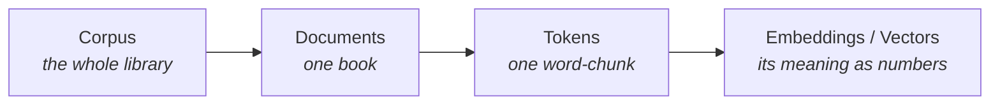

# Tokens, Context Windows & NLP Terms

This topic covers the practical "text mechanics" that affect anything you build with an
LLM API: how text is chopped into **tokens** (which drives pricing), how much the model
can "see at once" (the **context window**), and the core NLP vocabulary you'll keep
meeting.

## Part A — Tokenization

- **Tokenization** = converting raw text into a sequence of tokens.
- A **token** is basically a chunk of text that the model reads.

### How is text split into tokens?

- **Word-based tokenization** — text split into individual words.
    - `"I love AI"` → `["I", "love", "AI"]` → 3 tokens
- **Subword tokenization** — some words can be split further (helpful for long words).
    - `"understanding"` → `["under", "standing"]` → 2 tokens

!!! tip "Rule of thumb"
    - 1 token ≈ 4 characters in English (approximate)
    - 1 token ≈ ¾ of a word

Each model can have its **own** tokenization method:

- The same sentence can produce a different number of tokens in different models.
- Each company (OpenAI, Anthropic, Meta, …) chooses their own strategy.
- This affects pricing, context window capacity, and performance.

!!! note "Why a Java dev calling an LLM API cares"
    - APIs bill **per token** (both input *and* output tokens).
    - Longer system prompts = more tokens = more \$ per call.
    - Cost estimation: `(input tokens + expected output tokens) × rate`.

## Part B — Context Window

- The number of tokens an LLM can consider when generating text.
- Includes **both** your input (prompt) **and** the output (response).
- The larger the context window, the more information and coherence — but it requires
  more memory and processing power.
- Often the first factor to look at when choosing a model.

!!! example "Context windows grow over time — these are rough, indicative numbers"
    | Model (family) | Context window |
    |---|---|
    | Claude 3 / 3.5 / 4 | 200K tokens (Claude 4+ "1M context" variants up to 1,000,000) |
    | GPT-4o | 128K tokens |
    | Llama 3.1 / 3.3 | 128K tokens |
    | Llama 2 | 4K tokens — only short conversations (older generation) |
    | Claude 2.1 | 200K tokens (older generation) |

!!! note "Practical implications when building"
    - Long docs (contracts, codebases) need a big context window.
    - Chat apps need to manage conversation history against this limit.
    - "Prompt too long" errors = context window exceeded — summarize or truncate.
    - Larger context doesn't always mean better: accuracy can degrade as you fill it up
      (the "lost in the middle" effect).

## Part C — Core NLP Terms

NLP (Natural Language Processing) is the field of getting computers to work with human
language. A handful of terms come up constantly:

- **Corpus** — the entire collection of text used (for training or processing).
    - Example: "all of Wikipedia" or "5 years of our support emails".
- **Document** — a single unit of text within the corpus.
    - Example: one Wikipedia article, one email, one PDF.
- **Vocabulary** — the set of all unique words/tokens the model knows.
- **Token** — the smallest chunk the model reads (see Part A) — a word or subword.
- **Embedding** — a token (or chunk of text) turned into a list of numbers (a vector)
  that captures its **meaning**.
    - Words with similar meaning end up close together in this number-space.
    - Example: "king" and "queen" sit near each other; "king" and "banana" sit far apart.
    - Why it matters later: embeddings power **semantic search** and **RAG** (finding
      text by meaning, not just keyword match).
- **Vector** — just the list of numbers an embedding produces
  (e.g. `[0.12, -0.04, 0.88, …]`). Stored in a **vector database** when you build RAG
  systems.

!!! tip "Think of it as"
    - **Corpus** = the whole library of documents you're working with.
    - **Vocabulary** = the dictionary of every distinct token that can appear.

### How they nest

## Key Takeaways

- A **token** is a chunk of text (word or subword); models bill per token, so tokens
  drive cost. Rule of thumb: 1 token ≈ 4 characters ≈ ¾ of a word.
- The **context window** is how many tokens a model can consider at once — input *and*
  output together. Exceeding it causes "prompt too long" errors.
- An **embedding** turns text into a vector of numbers that captures meaning; similar
  meanings sit close together. This powers semantic search and RAG.
- The nesting to remember: **corpus → documents → tokens → embeddings**.
