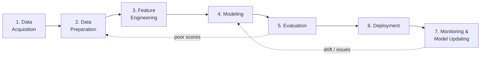

# Topic 4: Customizing & Shipping Models

This topic covers two things:

- **Part A** — how to **customize** an existing Foundation Model for your use case
  (fine-tuning, distillation) without training from scratch.
- **Part B** — the **end-to-end GenAI pipeline**: the steps to ship a real GenAI product.

For NLP terms used here (tokenization, embeddings), see
[Topic 3](03-tokens-and-language.md).

## Part A — Fine-Tuning & Distillation

Two broad techniques to customize a Foundation Model:

- **Fine-tuning** (adjust the model's weights) — has two flavours:
    - **Supervised fine-tuning** — learns from labelled input/output pairs.
    - **Reinforcement fine-tuning** — learns from a reward function scoring outputs.
- **Distillation** — make the model smaller and cheaper while keeping most of its
  behaviour.

### Fine-tuning a model

- Adapt a **copy** of a foundation model with your own data.
- Fine-tuning **changes the weights** of the base foundation model.
- Training data must:
    - Adhere to a specific format (usually prompt/completion pairs, often in JSONL).
    - Be stored somewhere the training job can reach (object storage, dataset hub, …).

!!! warning
    Not all models can be fine-tuned — check the model card.

### Supervised fine-tuning

- Improves the performance of a model on specific tasks.
- Further trained on a particular field or area of knowledge.
- Uses labeled examples that are input–output pairs:

```json
{
  "prompt": "Who is Stephane Maarek?",
  "completion": "Stephane Maarek is an AWS instructor..."
}
```

You give it the question **and** the correct answer — so it learns exactly what to say.

### Reinforcement fine-tuning

- Improves your FM using **feedback-based learning**.
- You provide the input data (training data / prompts).
- You define a **reward function** to evaluate responses and judge which are good:
    - **Objective tasks** → a deterministic scoring function in code
      (e.g. "does the output match the expected JSON schema?").
    - **Subjective tasks** → use another model as a judge, given evaluation instructions.
- The model learns iteratively from reward scores, trying to achieve high scores over
  time.

!!! example "Technical customer support chatbot"
    Prompt: *"My app is running very slowly"*

    | Response | Score | Why |
    |---|---|---|
    | "Restart the app" | 5.0 | Helpful but superficial |
    | "That sounds frustrating. Can you tell me when it started?" | 9.0 | Empathetic, diagnostic |
    | "Please open a support ticket" | 2.0 | Not helpful, pushes work to user |

    The model learns to give responses like the second one.

### Supervised vs reinforcement fine-tuning (key difference)

| | You provide | The model learns from |
|---|---|---|
| **Supervised** | BOTH input AND output | The exact answers you gave |
| **Reinforcement** | ONLY input | Scores on the multiple outputs it generated |

### Distillation

- Making models **smaller and faster**.
- Up to **75% less expensive** than original models.
- A decrease in accuracy, but potentially acceptable.
- A larger (**teacher**) model transfers knowledge to a smaller (**student**) model.
- You provide input data (e.g. prompts); produces a lighter model with similar behavior.
- Focuses on efficiency, speed, and cost reduction.

### Fine-tuning: good to know

- Re-training an FM requires a higher budget.
- Supervised fine-tuning is usually cheaper (less computation, less data needed).
- Requires experienced ML engineers to perform the task.
- Running a fine-tuned model is usually **more** expensive than using the base model
  (exact pricing depends on the provider).

### Fine-tuning use cases

- A chatbot with a particular persona or tone, or for a specific purpose
  (assisting customers, crafting advertisements).
- Training with more up-to-date information than the model previously accessed.
- Training with **exclusive** data (your historical emails, customer service records).
- Targeted use cases (categorization, assessing accuracy).

## Part B — End-to-End Generative AI Pipeline

### What is a GenAI pipeline?

- The set of steps followed to build an end-to-end GenAI software product.
- The idea: break the problem into sub-problems and develop a step-by-step procedure to
  solve them.
- Since language (or image/audio) processing is involved, you also list every form of
  processing needed at each step. This step-by-step processing of data is the
  "pipeline".

!!! tip "Think of it as"
    An assembly line: raw data enters at one end, a deployed, monitored GenAI
    application comes out the other end.

### The 7 stages



#### 1. Data Acquisition

Get the data needed to train / fine-tune / ground the model. Three situations:

- **Available Data** — you already have files on hand.
    - Formats: CSV, TXT, PDF, DOCS, XLSX.
    - Example: a company already has 5 years of support emails in CSV.
- **Other Data** — data exists somewhere, but not with you.
    - Sources: databases, the internet, APIs, web scraping.
    - Example: pull tweets via an API, or scrape product reviews.
- **No Data** — none exists, you have to create it.
    - Techniques: manual labelling, synthetic data generation, data augmentation.
    - Example: there's no dataset of "polite customer replies in Tamil" — you create one.

!!! info "Image augmentation (a special case of creating more data)"
    Applies transformations (rotate, flip, crop, change brightness) to existing images.
    Helps the model generalize, and grows a small dataset cheaply without collecting new
    samples.

#### 2. Data Preparation

Clean and standardize the raw data so it's usable. Typical actions: remove duplicates,
fix encoding, drop irrelevant fields, handle missing values, normalize
casing/punctuation, strip HTML, etc.

#### 3. Feature Engineering

Convert prepared data into features the model can learn from.

- For **text**: tokenization, embeddings, etc. (See
  [Topic 3](03-tokens-and-language.md) for tokenization basics and NLP vocabulary.)
- For **images**: resizing, normalization, augmentation.
- Good features matter more than fancy models.

#### 4. Modeling

Pick an approach: train from scratch (rare), fine-tune a foundation model, or just
prompt one. For GenAI, you're usually choosing a Foundation Model and either:

- Using it as-is with good prompts.
- Fine-tuning it on your data (see Part A above).
- Grounding it with **RAG** (Retrieval-Augmented Generation).

#### 5. Evaluation

How do you know the model is any good?

- Use task-appropriate metrics (accuracy, BLEU, ROUGE, human ratings, etc.).
- For GenAI, evaluation often needs humans or another model acting as a judge, because
  "quality" is subjective.

#### 6. Deployment

Put the model behind an API / app / chatbot so real users can reach it. Concerns:
latency, cost-per-request, scaling, security, rate limiting.

#### 7. Monitoring & Model Updating

- Models degrade over time (data drift, user behaviour changes, new topics appear).
- **Monitor:** accuracy, latency, cost, user feedback, hallucination rate, abuse
  patterns.
- **Update:** retrain, fine-tune again, swap the base model, or refresh the knowledge
  base.

!!! note "A note on pipelines in real life"
    The stages aren't strictly linear. You'll loop back constantly:

    - Poor evaluation scores → back to data prep or modeling.
    - Production issues → back to monitoring inputs, then back to training data.

    The pipeline is a mental model, not a waterfall.
