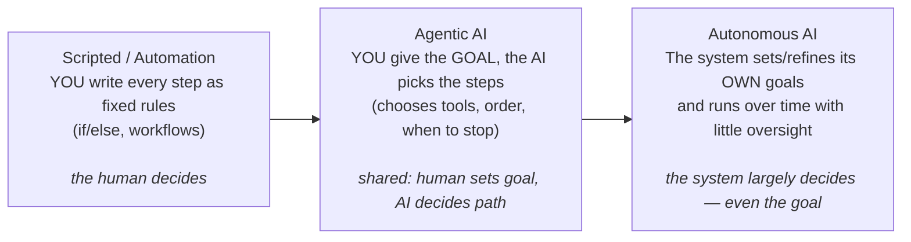

# Topic 5: Autonomous AI vs Agentic AI

These two terms get used interchangeably, but they are **not** the same thing. The
cleanest way to understand them is as a **spectrum of autonomy** — how much the system
decides for itself versus how much a human (or a hard-coded script) decides for it.

This is the first "agentic" note (start of Phase 1). It sets up the mental model for
everything that follows: tools, the agent loop, and multi-agent systems.

## The Starting Point: A Plain LLM

- A plain LLM just talks. You send text, it sends text back. (See
  [Topic 2](02-models.md).)
- It does **not** do anything in the world — no calling APIs, no running code, no
  deciding what to do next. It has no tools and no loop.

!!! tip "Think of it as"
    A very smart person locked in a room who can only pass notes under the door. They
    can advise, but they can't act.

## The Spectrum of Autonomy

It's a **dial, not two boxes**. Real systems sit somewhere along this line.

!!! note "Key relationship"
    Every autonomous system is agentic, but **not** every agentic system is autonomous.

    - **Agentic** = the *capability* (can decide & act).
    - **Autonomous** = the *degree* of independence you grant it (how long, how
      unsupervised, whether it sets its own goals).

## Agentic AI — Definition

An AI system that has **agency**: given a goal, it decides which actions/tools to use
and in what order, observing results and adapting as it goes.

Defining traits (the "agent" recipe):

1. **Tools** — functions it can call (search, run code, read a file, hit an API).
2. **A loop** — act → observe → decide next → repeat → finish.
3. **Autonomy** — *it* chooses the tool and the next step, not a hard-coded if/else.

But typically:

- Works toward a goal a **human** gave it (bounded scope).
- Often has a human in or near the loop (approvals, review).
- Has guardrails: max steps, allowed tools, stop conditions.

Most "AI agents" you hear about today are **here**.

!!! example
    - A coding assistant that, told "fix this failing test", reads files, edits code,
      runs the test, and iterates until it passes.
    - A research agent that, given a question, decides to search the web, read pages,
      and synthesize an answer.

!!! tip "Think of it as"
    An employee you give a task to. They decide *how* to do it, but the task came from
    you, and they check in / stay within bounds.

## Autonomous AI — Definition

An AI system that operates **independently over time** with little or no human
oversight. On top of agentic capability, it adds:

- May set or refine its **own** sub-goals (not just steps toward your goal).
- Runs continuously / unsupervised (no per-step approval).
- Acts in the real world without a human gating each action.

"Autonomous" emphasizes **independence and duration**, not just decision-making.

!!! example
    - A self-driving car making thousands of real-time decisions with no human input.
    - An agent left running on a schedule that monitors systems and takes corrective
      action on its own, day after day.

!!! tip "Think of it as"
    A fully empowered manager who runs a function on their own, sets their own
    priorities, and only reports back occasionally.

## Side-by-Side Comparison

| Dimension | Agentic AI | Autonomous AI |
|---|---|---|
| Goal | Given by a human | May set/refine its own |
| Decides the steps? | Yes | Yes |
| Decides the goal? | Usually no | Often yes |
| Human oversight | In or near the loop | Little to none |
| Duration | Task-scoped (start → done) | Ongoing / continuous |
| Scope | Bounded (tools, max steps) | Broad, open-ended |
| Typical today | Very common | Rare / emerging, higher risk |
| Relationship | The capability | A high degree of that capability |

## Why Autonomy = More Power but More Risk

More autonomy means fewer human checkpoints, so:

- Errors can compound before anyone notices (it kept acting on a wrong assumption).
- Harder to predict and audit ("why did it do that 40 steps ago?").
- Bigger blast radius if a tool does something destructive.

That's why real systems add **guardrails** as autonomy increases:

- Max iterations / step limits (stop runaway loops).
- Human-in-the-loop approval for risky actions (spend money, delete data, send email).
- Restricted tool sets and permissions.
- Logging / observability so you can trace decisions.

## Key Takeaways

- Autonomy is a **spectrum**: scripted → agentic → autonomous.
- **Agentic** = has tools + a loop + decides the steps toward *your* goal.
- **Autonomous** = does all that PLUS runs independently over time, often setting its
  own goals, with minimal oversight.
- Every autonomous system is agentic; not every agentic system is autonomous.
- More autonomy = more capability **and** more risk → add guardrails as you move right.
- In this course we build **agentic** systems first (bounded, human-in-the-loop). Full
  autonomy is the far end of the dial, approached carefully.
