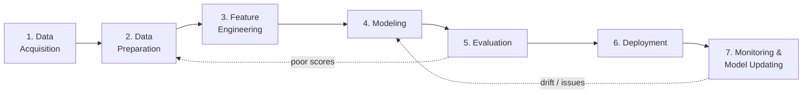

# End-to-End Generative AI Pipeline

Customizing a model (the previous note) is only one step in shipping a real product.
This note zooms out to the **whole pipeline**: the sequence of stages that takes you from
raw data to a deployed, monitored GenAI application.

For the customization step referenced inside the pipeline, see
[Customizing Models](04-customizing-models.md). For NLP terms used here (tokenization,
embeddings), see [Tokens & Language](03-tokens-and-language.md).

## What is a GenAI pipeline?

- The set of steps followed to build an end-to-end GenAI software product.
- The idea: break the problem into sub-problems and develop a step-by-step procedure to
  solve them.
- Since language (or image/audio) processing is involved, you also list every form of
  processing needed at each step. This step-by-step processing of data is the
  "pipeline".

!!! tip "Think of it as"
    An assembly line: raw data enters at one end, a deployed, monitored GenAI
    application comes out the other end.

## The 7 stages

### 1. Data Acquisition

Get the data needed to train / fine-tune / ground the model. Three situations:

- **Available Data** — you already have files on hand.
    - Formats: CSV, TXT, PDF, DOCS, XLSX.
    - Example: a company already has 5 years of support emails in CSV.
- **Other Data** — data exists somewhere, but not with you.
    - Sources: databases, the internet, APIs, web scraping.
    - Example: pull tweets via an API, or scrape product reviews.
- **No Data** — none exists, you have to create it.
    - Techniques: manual labelling, synthetic data generation, data augmentation.
    - Example: there's no dataset of "polite customer replies in Tamil" — you create one.

!!! info "Image augmentation (a special case of creating more data)"
    Applies transformations (rotate, flip, crop, change brightness) to existing images.
    Helps the model generalize, and grows a small dataset cheaply without collecting new
    samples.

### 2. Data Preparation

Clean and standardize the raw data so it's usable. Typical actions: remove duplicates,
fix encoding, drop irrelevant fields, handle missing values, normalize
casing/punctuation, strip HTML, etc.

### 3. Feature Engineering

Convert prepared data into features the model can learn from.

- For **text**: tokenization, embeddings, etc. (See
  [Tokens & Language](03-tokens-and-language.md) for tokenization basics and NLP
  vocabulary.)
- For **images**: resizing, normalization, augmentation.
- Good features matter more than fancy models.

### 4. Modeling

Pick an approach: train from scratch (rare), fine-tune a foundation model, or just
prompt one. For GenAI, you're usually choosing a Foundation Model and either:

- Using it as-is with good prompts.
- Fine-tuning it on your data (see [Customizing Models](04-customizing-models.md)).
- Grounding it with **RAG** (Retrieval-Augmented Generation).

### 5. Evaluation

How do you know the model is any good?

- Use task-appropriate metrics (accuracy, BLEU, ROUGE, human ratings, etc.).
- For GenAI, evaluation often needs humans or another model acting as a judge, because
  "quality" is subjective.

### 6. Deployment

Put the model behind an API / app / chatbot so real users can reach it. Concerns:
latency, cost-per-request, scaling, security, rate limiting.

### 7. Monitoring & Model Updating

- Models degrade over time (data drift, user behaviour changes, new topics appear).
- **Monitor:** accuracy, latency, cost, user feedback, hallucination rate, abuse
  patterns.
- **Update:** retrain, fine-tune again, swap the base model, or refresh the knowledge
  base.

!!! note "A note on pipelines in real life"
    The stages aren't strictly linear. You'll loop back constantly:

    - Poor evaluation scores → back to data prep or modeling.
    - Production issues → back to monitoring inputs, then back to training data.

    The pipeline is a mental model, not a waterfall.
