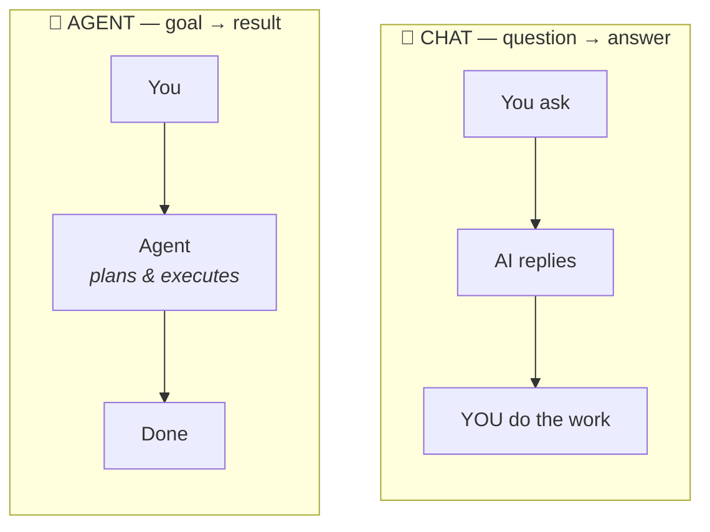
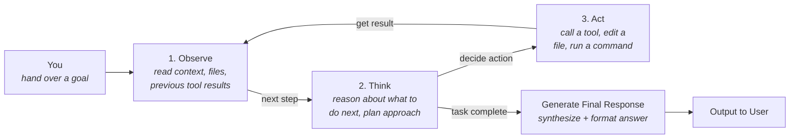
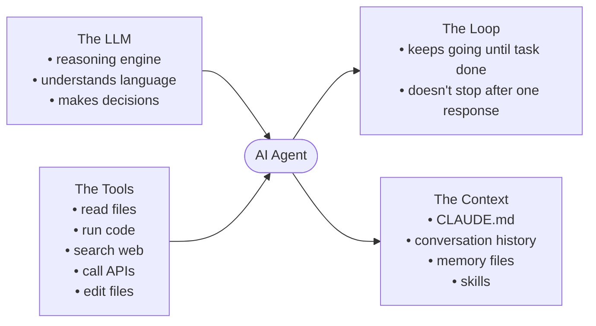

# Anatomy of an Agent

What is actually inside an "AI agent"? This note covers the foundational mental model:
the chat-to-agent leap, the loop that drives an agent, the four components every agent
is built from, the platform it runs on (the "harness"), how to feed it the right
information (prompt vs. context engineering), and how it reaches out to the world
(tools). Tools get their own deeper note next: [Tools & MCP](08-tools-and-mcp.md).

These are Phase 1 building blocks. They are independent of any specific framework — the
same patterns show up in Claude Code, LangChain, Manus, plain SDK code, anything.

## Chat vs Agent — the Conceptual Leap

The cleanest one-line definition:

| Chat Model | Agent |
|---|---|
| question → answer | goal → result |

Side by side, the difference is in **who does the work**:

In chat, the AI hands the work back to you. In an agent, the work comes back done.

- A **chat model** is a back-and-forth exchange. You ask, it answers, you do the work,
  you ask again.
- An **agent** is delegation. You hand over a goal; it plans, picks tools, takes steps,
  and only comes back when the work is done.

!!! tip "Think of it as"
    The difference between *advice* and *delegation*. A chat model gives you advice. An
    agent does the job.

!!! note "For a Java dev"
    - A chat model is a pure function. `String -> String`. Stateless. Idempotent.
    - An agent is closer to a Spring `@Service` you hand a task to. It calls other beans
      (tools), does I/O, keeps working until the task is done, then returns a result.

This is the leap from "AI you talk to" to "AI that works for you."

## The Agent Loop

An agent is not a single LLM call. Internally it is a **loop** that runs until the work
is judged complete:

- **Observe** — gather context: the prompt, files in the workspace, results from
  earlier tool calls. Whatever is relevant to the current step.
- **Think** — decide what to do next. "I don't know X yet, so I need to call tool Y."
- **Act** — actually do something: call a tool, write a file, run code, send an email.
- **Repeat** — feed the action's result back into Observe. Keep looping.
- **Stop** — when the model judges that the task's exit criteria are met.

The exit criteria come from the prompt. *"Compile 10 sources and produce a PowerPoint"*
gives the agent a concrete finish line: 10 sources gathered **and** PowerPoint exists.

!!! example "Worked example"
    Prompt: *"build a minimalist portfolio site for Greg Isenberg, then host it locally
    so I can see it."*

    1. **Observe** — prompt loaded; workspace empty; no info on Greg.
    2. **Think** — "I don't know who Greg is; need to research."
    3. **Act** — call a web-search tool.
    4. **Observe** — research returned; now I know who Greg is.
    5. **Think** — "next I should write a plan."
    6. **Act** — create `plan.md`.
    7. **Think** — "now I should write the HTML."
    8. **Act** — create `index.html`.
    9. **Think** — "the task says host it locally and verify."
    10. **Act** — start a local server, screenshot the page.
    11. **Observe** — screenshot looks right; task complete.
    12. **Stop** — return summary to the user.

!!! note "For a Java dev"
    This is a `while` loop with a strategy choosing the next action and a registry of
    callable services (tools). The exit condition is not a counter — it is a model
    judgment. Always set a hard `maxIterations` safety so it cannot spin forever on a
    confused goal.

## The Four Components of an Agent

Every agent is built from exactly four parts. They all wire into the agent:

In words:

1. **LLM** — the brain. Picks the next step and writes the outputs.
   (Claude, GPT, Gemini, a local model via Ollama, …)
2. **Loop** — the act-observe-decide cycle. The thing that makes an agent an agent
   instead of a one-shot chat reply.
3. **Tools** — the hands. Functions the model can call: web search, file write, send
   email, run code, query a database.
4. **Context** — what the model knows about you and the situation: the system prompt,
   files in the workspace, memory of past sessions.

Take any one away and you don't have an agent:

| Remove… | …and you get |
|---|---|
| No LLM | It's just a script |
| No loop | It's a chat model — one reply and done |
| No tools | It can plan but cannot do anything in the world |
| No context | It gives generic answers that ignore who you are |

When an agent behaves unexpectedly, the cause usually traces to one of these four being
wrong — bad context, a missing tool, a loop that ended too early, or the model itself
making the wrong call.

## The Agent Harness

The harness is the application that runs the loop and wires the four components
together. It is not the agent — it is the *environment* the agent runs in.

Examples (late 2025 / 2026):

- **Claude Code** (Anthropic; CLI + IDE integration)
- **Codex** (OpenAI)
- **Antigravity** (Google)
- **Co.work** (workspace-style)
- **Manus** (web-based)
- **Perplexity Computer** (web-based)
- Open-source CLI agents
- …and many more, with new ones appearing regularly

Different harnesses ship different features — some have built-in memory, some schedule
tasks, some have nicer UIs — but the engine underneath is the same loop calling the same
kinds of tools against the same kinds of context.

!!! tip "Think of it as"
    Harnesses are like different cars — Toyota, Range Rover, Tesla. Once you learn to
    drive (steer, brake, accelerate), you can drive any of them. Some have heated seats
    and cruise control. The fundamentals are identical.

!!! note "For a Java dev"
    The harness is the runtime, like the JVM plus your application server (Tomcat,
    Spring Boot, etc.). Your agent's configuration — its prompts, tools, context files —
    is the portable code that can run on any compatible runtime.

Practical consequence: don't over-commit to one harness. Learn the concepts first; the
harness becomes interchangeable.

## Prompt Engineering vs Context Engineering

There has been a meaningful shift in how practitioners get good results out of LLMs.

The earlier approach — **prompt engineering**:

- Craft a long, highly detailed prompt.
- "You are a world-class expert in X. Follow these rules. Use this format…"
- The prompt does all the work. Without it, the model produces generic output.

The current approach — **context engineering**:

- Load the agent with rich, accurate background up front.
- Prompts can then stay short and simple — "Write a cold email."
- The model already has what it needs; it simply executes.

The same model and the same task produce very different results depending on the
context the model is given:

| Setup | Result |
|---|---|
| no context + "write a cold email" | generic placeholder text and numerous clarifying questions |
| full context + "write a cold email" | on-brand draft for your real ICP, ready to send |

### The mechanism

Every harness supports an auto-loaded markdown file at the project root that is read at
session start:

| Harness | File the harness auto-loads |
|---|---|
| Claude Code | `CLAUDE.md` |
| Gemini CLI | `GEMINI.md` |
| Codex / others | `AGENTS.md` (becoming the de facto standard) |

This file is the agent's "always-on" briefing. Typical contents:

- **The role:** "you are my executive assistant"
- **Who I am:** role, company, what we sell
- **Working preferences:** tone of voice, formats, what never to do
- **Tools available:** what's connected and what it's for

If the briefing gets large, split into a `context/` folder of markdown files
(`about-me.md`, `brand-voice.md`, `ideal-customer.md`, …) and add one line to the
auto-loaded file:

> "Before answering, read all files in `./context/` to learn who I am and how I work."

!!! note "For a Java dev"
    The auto-loaded file is `application.yml` for your agent — config read at startup so
    behaviour stays consistent without re-passing it each session. The `context/` folder
    is the rest of your config split across files. Same idea.

!!! tip "How to write a good context file"
    Open any chat model and say *"interview me to build my AGENTS.md file."* Answer its
    questions, then paste the result into the file.

!!! info "A side note that matters"
    Chat models like ChatGPT and Claude.ai have an *automatic* cloud-side memory.
    Helpful, but invisible and uncontrollable — and it bleeds context between unrelated
    projects. Your relationship advice can leak into your landing-page copy. Agents flip
    this around: memory is **explicit and file-based**. Less magic, but clean separation
    between projects. This is a feature, not a limitation.

## Tools

Tools are how an agent acts in the world — one of the four components above. A tool is a
callable function with:

- **a name** (e.g. `send_email`)
- **a description** — what it does (the model reads this to decide when to use it)
- **a parameter schema** — what arguments it takes
- **an implementation** — your code, or somebody else's, that actually runs

!!! note "For a Java dev"
    A tool is an injected service the model can call. The description and schema are the
    model's view of the interface; the implementation is your code behind it.

A single agent might have dozens of tools, and connecting each one used to mean bespoke
integration code. The standard that fixed that — and the way tools are wired into agents
today — is **MCP**, covered in its own note: [Tools & MCP](08-tools-and-mcp.md).

## What to Hold Onto

- **Agent = goal-to-result.** The leap from chat is the loop and the autonomy.
- The loop is **Observe → Think → Act → repeat → stop** on completion criteria.
- **Four components:** LLM, loop, tools, context. Diagnose problems against this list.
- The **harness** is the runtime. Learn the model, not the harness — they are
  interchangeable.
- **Context engineering > prompt engineering.** Load context once, keep prompts simple.
- Tools are how the agent does things — the fourth component. How they're standardised
  and wired in (MCP) is covered in [Tools & MCP](08-tools-and-mcp.md).
