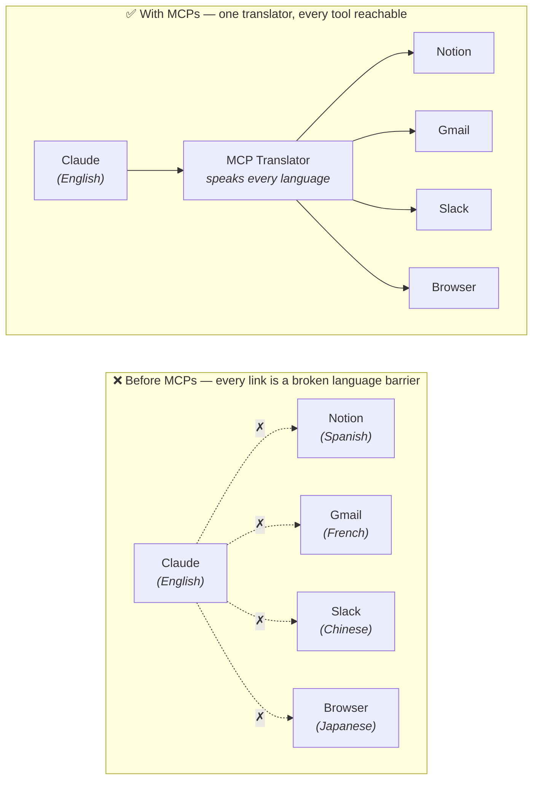
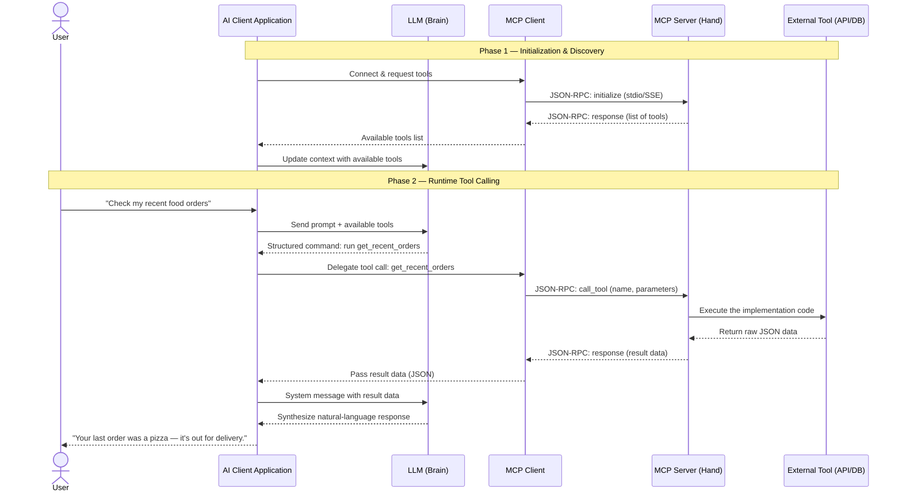

# Tools & MCP

Tools are how an agent acts in the world — one of the [four components of an
agent](07-anatomy-of-an-agent.md). This note goes deeper: how tools were wired into
agents before, the problem that created, and the standard that solved it — the **Model
Context Protocol (MCP)**.

## What a tool is (recap)

A tool is a callable function with:

- **a name** (e.g. `send_email`)
- **a description** — what it does (the model reads this to decide when to use it)
- **a parameter schema** — what arguments it takes
- **an implementation** — your code, or somebody else's, that actually runs

!!! note "For a Java dev"
    A tool is an injected service the model can call. The description and schema are the
    model's view of the interface; the implementation is your code behind it.

## Before MCP

Every tool needed its own bespoke integration. The model had to "learn the language" of
each one. Custom adapter code per tool, per agent, per harness — so connecting the same
tool to a second agent meant writing the glue all over again.

## After MCP

Anthropic introduced the **Model Context Protocol (MCP)** as a standard that sits between
agent and tool. Tools expose themselves through MCP once; any MCP-capable agent can call
them without bespoke code.

Picture the language barrier. Claude speaks English; each tool "speaks" its own
language. Without a translator, the connections just don't work. With one MCP
translator in the middle, every tool is reachable:

Connect once, call anything.

!!! note "For a Java dev"
    MCP is JDBC. Before JDBC, every database had its own driver and API and you wrote
    bespoke client code per database. JDBC standardised the interface — new databases
    just ship a JDBC driver and existing code "just works." MCP is doing the same for
    tools meeting LLMs. Same shape of solution.

## How a tool call actually flows

The before/after picture above is conceptual. Here is what really happens end to end,
in two phases: first the agent *discovers* what tools exist, then at runtime it *calls*
one. The pieces involved:

- **AI Client Application** — the harness (e.g. Claude Code) that runs the loop.
- **LLM** — the brain that decides *which* tool to call.
- **MCP Client** — whatever speaks the MCP protocol to the server. This is a *role*, not
  a mandatory separate program: the client application usually plays it itself. It is
  drawn as its own lane below only to make the protocol boundary easy to see.
- **MCP Server** — the tool's side; exposes the tools and runs their code.
- **External Tool** — the actual API or database behind it.

Two things worth noticing:

- **The LLM never touches the tool directly.** It only emits a *structured command*
  ("call `get_recent_orders`"); the client application does the actual calling (over
  MCP). This is the same act-observe split from the [agent
  loop](07-anatomy-of-an-agent.md#the-agent-loop).
- **Discovery happens first.** The model can only call tools it was told about in
  Phase 1. If a tool isn't in that list, the model doesn't know it exists — which is why
  a mis-configured MCP server shows up as "the agent won't use my tool."

!!! note "For a Java dev"
    **JSON-RPC** is just a simple request/response convention over a transport (here,
    `stdio` — standard input/output pipes — or `SSE`, server-sent events over HTTP).
    Think of it as a lightweight RPC call: a JSON message names a method and its
    parameters, and a JSON message comes back with the result. No heavy framework.

## The marketplace, and where this is heading

Most modern harnesses ship an MCP "marketplace" — one-click connectors for the major
tools (Gmail, Calendar, Notion, Stripe, GitHub, …). The end-state most people aim for:
you stop opening individual apps. Everything goes through the agent, which calls the apps
via MCP.

!!! info
    In LangChain — introduced in Phase 5 — the equivalent unit is the `@tool`
    decorator. Same conceptual building block; MCP is the more universal,
    language-agnostic version.

## Key Takeaways

- A **tool** is a callable function the model can invoke: name, description, schema,
  implementation.
- **Before MCP**, every tool needed bespoke integration code per agent and per harness.
- **MCP** is a standard interface between agents and tools — expose a tool once, and any
  MCP-capable agent can call it. **MCP is the JDBC of tools.**
- Harnesses ship MCP marketplaces; the direction of travel is that the agent becomes the
  single front door to all your apps.
